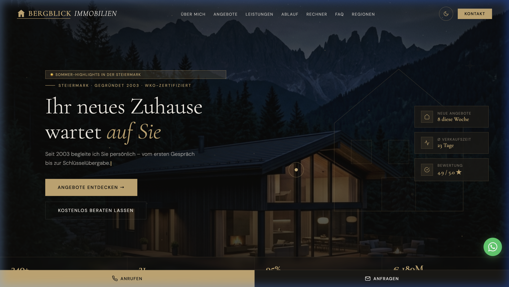
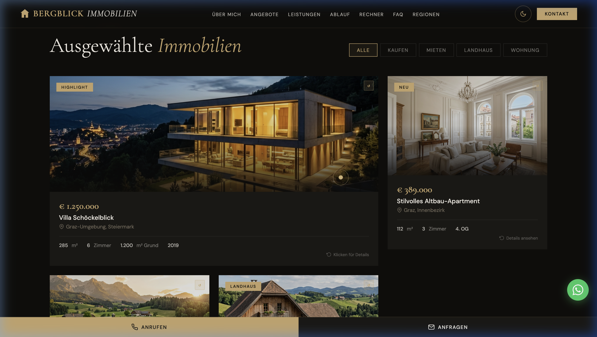

# 🏔️ Bergblick Immobilien – Real Estate Website

> **Live Demo:** [bergblick-immobilien.vercel.app](https://bergblick-immobilien.vercel.app)

A **luxury real estate website** built for Markus Holzer – a certified real estate agent based in Graz, Steiermark, Austria. The project focuses on premium design, smooth animations, and a full client-facing experience.

---

## 📸 Screenshots

### Hero Section


### Property Listings


---

## ✨ Features

| Feature | Description |
|---|---|
| 🌙 **Dark / Light Mode** | Toggle between elegant dark and light themes |
| 🏠 **Property Listings** | Flip-card animations showing property details |
| 🧮 **Mortgage Calculator** | Interactive sliders to calculate monthly payments |
| ✍️ **Typewriter Effect** | Animated hero headline with rotating phrases |
| ✨ **Gold Particle Canvas** | Animated particle system on the hero section |
| 📱 **Fully Responsive** | Mobile-first design with slide-out navigation |
| ♿ **Accessible** | ARIA labels, skip links, keyboard navigation |
| 🔍 **SEO Ready** | Structured data (JSON-LD), Open Graph, sitemap |
| 🗺️ **Regional Coverage** | Interactive area cards for all of Steiermark |
| 📋 **Contact Form** | Animated form with thank-you confirmation |

---

## 🛠️ Tech Stack

- **HTML5** – Semantic, accessible markup
- **Vanilla CSS** – Custom design system with CSS variables (no frameworks)
- **Vanilla JavaScript** – Zero dependencies, no build tools
- **Vercel** – Deployed and hosted

---

## 🎨 Design System

```css
:root {
  --gold:   #C9A96E;   /* Primary gold accent */
  --dark:   #0F0E0C;   /* Deep background */
  --cream:  #F5F0E8;   /* Light text */
  --accent: #6B8F71;   /* Green accent */
}
```

**Fonts:**
- `Cormorant Garamond` – Headings (luxury serif)
- `DM Sans` – Body text (clean sans-serif)

---

## 📁 Project Structure

```
bergblick-immobilien/
├── index.html          # Single-page application
├── img/
│   ├── hero-bg.png
│   ├── villa.png
│   ├── altbau_apartment.png
│   ├── modernes_einfamilienhaus.png
│   └── renovierter_bauernhof.png
└── screenshots/
    ├── hero.png
    └── properties.png
```

---

## 📊 Key Stats (from the website)

- **340+** properties successfully sold
- **21 years** of experience (since 2003)
- **95%** client recommendation rate
- **€ 180M** total volume handled
- **4.9 / 5.0** ⭐ average rating (87 reviews)
- **23 days** average selling time

---

## 🏘️ Property Listings

| Property | Price | Size | Location |
|---|---|---|---|
| Villa Schöckelblick ⭐ | € 1,250,000 | 285 m² · 6 rooms | Graz-Umgebung |
| Altbau-Apartment | € 389,000 | 112 m² · 3 rooms | Graz, Innenbezirk |
| Modern Family House | € 595,000 | 178 m² · 5 rooms | Weiz, Oststeiermark |
| Renovated Farmhouse | € 745,000 | 320 m² · 7 rooms | Murau, Weststeiermark |

---

## 🗺️ Regional Coverage

- **Graz & Umgebung** – 48 active listings
- **Oststeiermark** – 31 active listings (Weiz, Feldbach, Riegersburg)
- **Weststeiermark** – 27 active listings (Deutschlandsberg, Ligist)
- **Murtal & Murau** – 22 active listings (Judenburg, Knittelfeld)

---

## 🚀 Getting Started

No build tools required. Simply open `index.html` in any browser.

```bash
git clone https://github.com/YOUR_USERNAME/bergblick-immobilien-website
cd bergblick-immobilien-website
open index.html
```

Or deploy instantly with Vercel:

[](https://vercel.com/new/clone?repository-url=https://github.com/YOUR_USERNAME/bergblick-immobilien-website)

---

## 👤 About the Client

**Bergblick Immobilien** – Markus Holzer
- 📍 Hauptplatz 12, 8010 Graz, Steiermark, Austria
- 📞 +43 316 123 45
- 📧 office@bergblick-immobilien.at
- 🕐 Mon–Fri: 09:00–18:00 | Sat: 09:00–13:00
- 🏅 WKO-Certified Real Estate Agent since 2003

---

## 📜 License

This project is built as a client portfolio project. All content belongs to Bergblick Immobilien.

---

*Built by **Alae Eddine** – KI Architekt & Web Developer*
